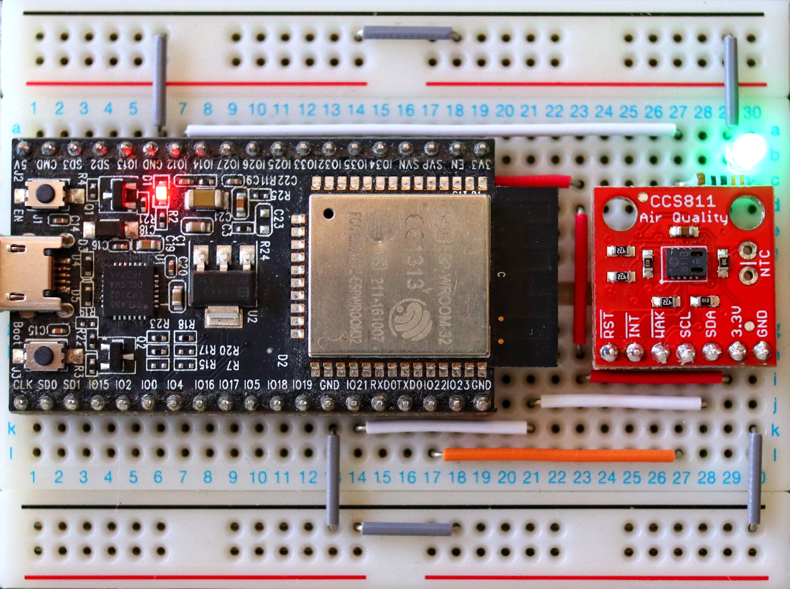

## Air Quality Monitoring Using Edge Impulse ☁️

🎒 Assignment for the Wireless Sensor Networks (IoT) course, ACES, ETTI.

📚 Project documentation: https://ocw.cs.pub.ro/courses/iothings/proiecte/2021/airqualityedgeimpulse

 

